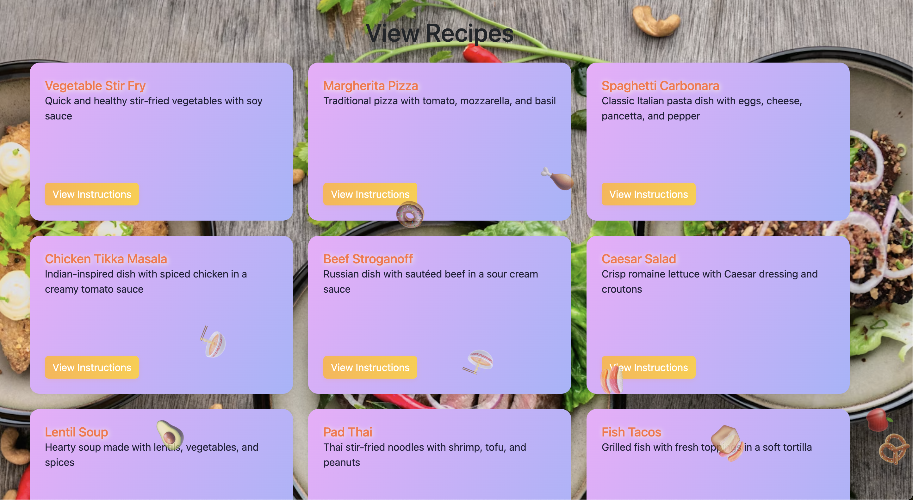

# 🍽️ Recipe Sharing Platform

A vibrant, interactive web app for sharing, searching, and discovering recipes! Enjoy a food-themed experience with animated backgrounds and a beautiful, modern UI.

---


---

## ✨ Features
- Share your favorite recipes with the world
- Search recipes by ingredient
- Flip-card UI with instructions on the back
- Food-themed animated backgrounds and emoji effects
- Modern, responsive design

## 🚀 Getting Started

### Prerequisites
- Node.js (v18+ recommended)
- PostgreSQL (v15+ recommended)
- [Liquibase](https://www.liquibase.org/) (for database migrations)

### 1. Clone the repository
```bash
git clone <your-repo-url>
cd share-my-recipe
```

### 2. Install dependencies
```bash
npm install
```

### 3. Configure the database
- Make sure PostgreSQL is running.
- Update `src/index.ts` with your database credentials if needed.
- Create a database named `postgres` (or update the config).

### 4. Run database migrations
```bash
liquibase update
```

### 5. Start the app
```bash
npm start
```

The app will be running at [http://localhost:3000](http://localhost:3000)

---

## 📸 Screenshots

### Landing Page


### Recipes Page


*Replace the above images with your own screenshots in the `docs/` folder for best results!*

---

## 💡 Customization
- To change the food background or emoji effects, edit the CSS and JS in the EJS view files in `src/views/`.
- To add more recipes or instructions, update the CSV files and rerun migrations.

---

## 📬 Feedback & Contributions
Pull requests and issues are welcome! Enjoy sharing and discovering new recipes! 🍲
