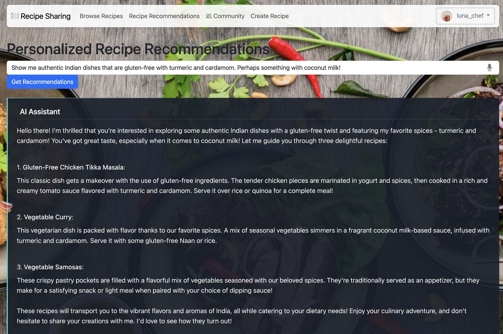

# 🍽️ Share My Recipe

A vibrant, interactive web application for sharing, discovering, and managing recipes with AI-powered search capabilities. Enjoy a delightful food-themed experience with a modern, responsive design.




## ✨ Key Features

### Recipe Management
- Create, edit, and delete your personal recipes
- Organize recipes with categories, cuisines, and ingredients
- Step-by-step cooking instructions
- User-friendly recipe editing interface

### AI-Powered Search
- Natural language recipe search using LLMs
- Understands dietary preferences, cuisines, ingredients, and cooking methods
- Intelligent cuisine detection and recommendation
- Smart handling of ingredient exclusions and inclusions
- Fallback mechanisms for when AI is unavailable

### User Experience
- User authentication and profile management
- Personal recipe dashboard
- Mark recipes as favorites for quick access
- Responsive design works on all devices
- Flip-card UI with recipe instructions on the back
- Food-themed animated backgrounds and emoji effects

### Glossary & Cuisine Support
- Jewish cuisine recognition and special handling
- Multi-cuisine support (American, Italian, Mexican, Chinese, etc.)
- Ingredient glossary and term expansion
- Dietary preference recognition (vegetarian, kosher, gluten-free, etc.)

## 🛠️ Technology Stack

- **Backend**: Node.js with TypeScript
- **Frontend**: EJS templates, TailwindCSS
- **Database**: PostgreSQL with Liquibase for migrations
- **Authentication**: Passport.js
- **AI Integration**: Local AI model support (Mistral, VLLM, Ollama)
- **Containerization**: Docker & Docker Compose

## 🚀 Getting Started

### Prerequisites
- Node.js (v18+ recommended)
- PostgreSQL (v15+ recommended)
- [Liquibase](https://www.liquibase.com/community) (for database migrations)
- Docker & Docker Compose (optional, for containerized setup)

### 1. Clone the repository
```bash
git clone <your-repo-url>
cd share-my-recipe
```

### 2. Install dependencies
```bash
npm install
```

### 3. Configure the database
- Make sure PostgreSQL is running
- Update environment variables or `src/index.ts` with your database credentials
- Create a database or use the default `postgres` database

### 4. Run database migrations
```bash
liquibase update
```

### 5. Start the app
```bash
npm start
```

The app will be running at [http://localhost:3000](http://localhost:3000)

## 🔍 AI Search Setup (Optional)

The application supports various LLM backends for enhanced recipe search:

- **Local AI**: Connect to LocalAI, Ollama, or VLLM
- **Environment Variables**:
  - `LLM_MODEL`: Specify the model to use (e.g., 'mistral')

If the AI service is unavailable, the app falls back to standard search mechanisms.

## 🔄 How It Works

1. **User Authentication**: Register and log in to create and manage recipes
2. **Recipe Creation**: Add recipes with title, description, ingredients, and instructions
3. **Recipe Discovery**: Browse all recipes or search by keywords, categories, or cuisines
4. **AI-Powered Search**: Get personalized recommendations based on natural language requests like "vegetarian pasta without mushrooms" or "kosher desserts"
5. **Favorites**: Save recipes you love to your favorites list for easy access
6. **Profile Management**: View and edit your profile information

## 🧪 Development

### Testing
```bash
npm test
```

### Building for production
```bash
npm run build
```

## 📬 Feedback & Contributions
Pull requests and issues are welcome! Enjoy sharing and discovering new recipes! 🍲
